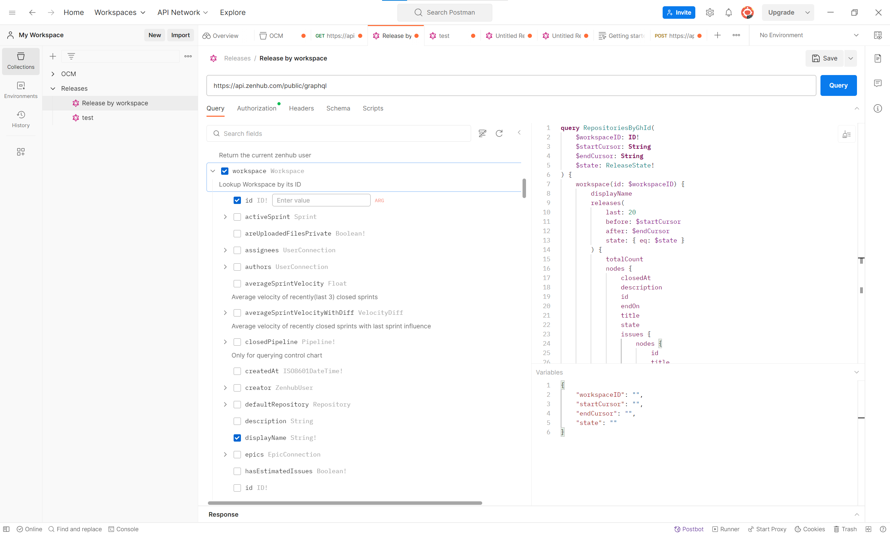
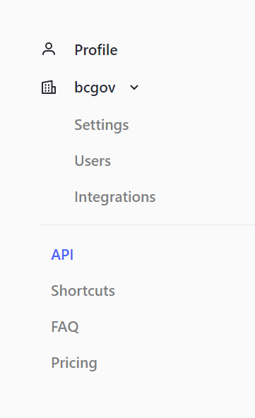
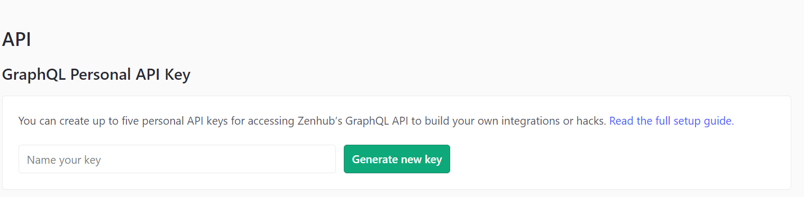
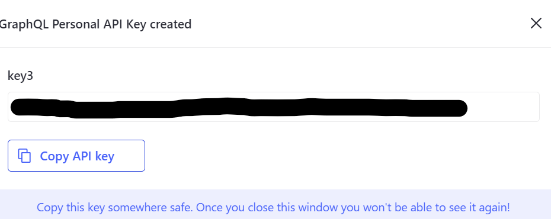

# SBC-ProductHub
This Repo consists of 2 projects:

1. **Metrics report** (Within application-status folder)

2. **Release Notes** (Within release-notes folder)
## Apps

### Application Status
An MVP Product [Metrics Report](www.metrics.bcregistry.gov.bc.ca)

The app focuses on getting the metrics for all products developed by **Ministry of Citizen Services, Business Registry Branch**.

The app displays statistics of what teams have been working on during the last sprint, so that teams can reflect on their performance and keep track of the development progress. 

### Release Notes
An MVP Product [Release Notes](https://www.release-notes.bcregistry.gov.bc.ca/)

The app focuses on displaying releases for all products developed by **Ministry of Citizen Services, Business Registry Branch**.

Audience can get latest updates about the BC Registries products, what has been fixed, new features, improvements, etc.

## Tech Stack
### Nuxt.js/ Vue.js/ TypeScript
Please refer to this documentation to see how the codespace layout is set up. Look at the [documentation](https://nuxt.com/docs/getting-started/introduction) to learn more.

### Zenhub GraphQL API and Apollo Client
#### What is Zenhub API?

[Getting Started](https://developers.zenhub.com/graphql-api-docs/getting-started)

[Postman Collection](https://developers.zenhub.com/graphql-api-docs/postman-collection)



#### What is Apollo Client? 

[Apollo Client on Vue.js](https://v4.apollo.vuejs.org/guide/installation.html)

[Apollo Client Usage](https://www.apollographql.com/docs/react/get-started/)

## Set up the project
1. Navigate to correct folder

    `cd apps/application-status` or
    `cd apps/release-notes`
2. Install the package
    ```
    pnpm install
3. Retrieve the Zenhub Token
    
    a. Go to your account management at the bottom left of the page

    b. Click on API

    

    c. In GraphQL API, name your key, then click **Generate New Key**
    

    d. Copy the generated key to .env file
    
    
    e. In .env file, save the key as:
    ```
        ZENHUB_APIKEY=[API Key copied above]
    ```

    f. Launch the web on local host: http://localhost:3000/ 
    ```
    pnpm run dev
    ```

